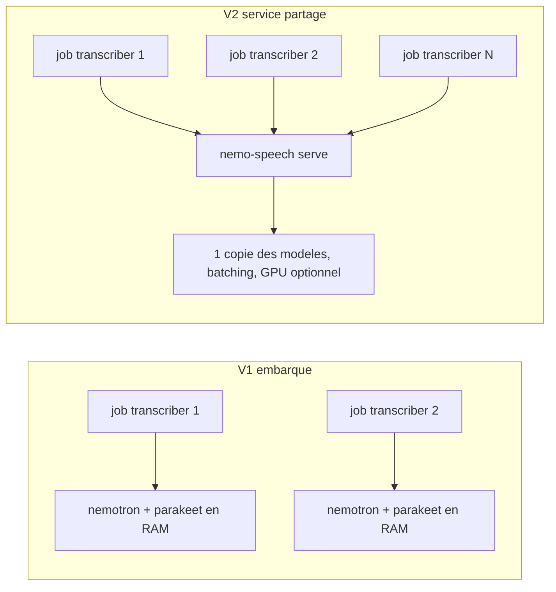

# Review technico-fonctionnelle: intégration Parakeet / Nemotron (NeMo-Speech.cpp)

Périmètre: l'ensemble du code non commité au 2026-08-28 (10 fichiers modifiés, 9 nouveaux).
Document de travail interne, à ne pas pousser dans la PR upstream.

Cible retenue avec le mainteneur:

- V1 (court terme): mode embarqué cgo durci, exploitable pour du test et une charge faible.
- V2 (cible): service d'inférence NeMo-Speech partagé, le transcriber devient un client léger.
  Objectif: plusieurs réunions et enregistrements simultanés sans dupliquer les modèles ni
  saturer le CPU.
- Contrainte: le code doit rester présentable pour un upstream Mattermost. Les docs et le
  setup de dev locaux restent hors PR.

## 0. Vérifications factuelles effectuées

Ces points sont confirmés, l'intégration ne repose pas sur des suppositions:

- `NVIDIA/NeMo-Speech.cpp` existe, release `v0.1.0`, archive `nemo-speech-0.1.0-linux-x86_64-cpu.tar.gz`
  (4,58 Mo) et variante `aarch64`. Chaque archive publie un fichier `.sha256` adjacent.
- L'ABI utilisée dans `asr.go` correspond au header réel `include/nemo_speech/asr.h`:
  `nemo_speech_asr_create`, `recognize_f32`, `streaming_recognize`, `stream_push_f32`,
  `stream_next`, `stream_finish`, `stream_close`, accesseurs `result_*`. Les champs
  `streaming_config` (`chunk_size`, `ctc_left_padding`, `ctc_right_padding`,
  `rnnt_right_context`) sont exacts.
- Les valeurs par défaut documentées côté NeMo sont `chunk_size=0.16`, paddings `1.92`,
  `rnnt_right_context=1` (et `-1` = maximum du modèle). Les constantes du code sont donc
  cohérentes, sauf le choix `3` qui est un arbitrage latence/qualité à documenter.
- Threading documenté (`docs/sdk.md`): un recognizer peut servir plusieurs threads, mais
  un stream donné doit être piloté par un seul thread, et les handles modèle doivent
  survivre aux streams. L'architecture "1 recognizer partagé + 1 stream par piste" est
  donc conforme.
- `docs/development/asr-batching.md`: "Backend submission remains serialized... still
  serializes each ggml graph". Conséquence directe sur la scalabilité, voir section 3.
- L'ABI n'expose aucun réglage de threads CPU (`backend_config` ne contient que `gpu`).
- Les deux dépôts Hugging Face existent, non gated, et contiennent bien les fichiers
  `parakeet-tdt-0.6b-v3.q8_0.gguf` (CC-BY-4.0) et
  `nemotron-3.5-asr-streaming-0.6b.q8_0.gguf` (licence "other" = OpenMDW-1.1).
- L'archive CPU NeMo contient `libggml.so.0.12.0`, `libggml-base.so.0`, `libggml-cpu.so.0`,
  `libllama.so.0`, plus `libstdc++.so.6`, `libgcc_s.so.1`, `libgomp.so.1`, `libatomic.so.1`.
  Le conflit de SONAME avec whisper.cpp 1.7.5 est donc réel, voir P0-2.

Non vérifiable localement: la compilation. `go build ./...` échoue déjà sur `opus.h`,
`whisper.h`, `onnxruntime_c_api.h` hors conteneur. Le seul chemin de validation est
`make docker-build-parakeet`, et la CI ne compile jamais le tag `nemospeech` (voir P3-20).

## 1. Ce qui est bien fait

À conserver tel quel:

- Isolation par build tag propre: `asr.go` (`//go:build nemospeech`) et `stub.go`
  (`//go:build !nemospeech`) avec la même surface d'API. Le build par défaut reste intact.
- Usage correct de `runtime.Pinner` pour les structs C imbriquées, ce qui est le vrai piège
  cgo de cette ABI.
- Respect de la convention ABI: `size = sizeof(struct)`, `*_default()`, destruction des
  résultats, `last_error()` thread-local.
- `ResolveLanguageCode` / `ToISO6391` / `StripLangTags` sont testés et se dégradent vers
  l'auto-detect au lieu de crasher sur une valeur inconnue.
- `handleClose` détruit le recognizer live avant le post-traitement, donc les deux modèles
  ne sont pas résidents simultanément.
- `build/licenses/NOTICE` présent avec les trois licences, réflexe rare et correct.
- Le refactor de `prepare_deps.sh` (fetch idempotent + ccache + cache BuildKit) est une
  vraie amélioration, mais mal placée, voir P3-18.

## 2. P0: bloquants (correction avant tout test de charge)

### P0-1. Race sur le WaitGroup, use-after-free du recognizer

`processLiveCaptionsNemotron` incrémente le WaitGroup **à l'intérieur** de la goroutine:

```35:36:cmd/transcriber/call/live_captions_nemotron.go
	t.captionsPoolWg.Add(1)
	defer t.captionsPoolWg.Done()
```

Elle est lancée par `go` depuis `processLiveTrack`:

```147:151:cmd/transcriber/call/tracks.go
		if t.cfg.TranscribeAPI == config.TranscribeAPIParakeet {
			go t.processLiveCaptionsNemotron(ctx, pktPayloadCh)
		} else {
			go t.processLiveCaptionsForTrack(ctx, pktPayloadCh)
		}
```

et `handleClose` s'appuie sur ce WaitGroup avant de détruire le recognizer:

```267:271:cmd/transcriber/call/tracks.go
	t.captionsPoolWg.Wait()
	if t.liveASR != nil {
		_ = t.liveASR.Destroy()
		t.liveASR = nil
	}
```

Si `Add(1)` n'a pas encore été exécuté quand `Wait()` est appelé, `Wait()` retourne
immédiatement et `Destroy()` s'exécute en parallèle de `StartStream` / `Push` / `Next`.
La doc NeMo est explicite: le handle modèle doit survivre aux streams. Résultat probable:
SIGSEGV dans le C, job perdu, aucun transcript. Le chemin whisper n'a pas ce problème car
l'`Add` est fait dans `startTranscriberPool`, avant tout `Wait`.

Le mutex de `Recognizer` ne protège rien ici: `Stream.Push` / `Next` ne le prennent pas.

Action: faire l'`Add(1)` dans `processLiveTrack` avant le `go`, et introduire un compteur
de streams vivants (WaitGroup dédié `liveASRWg`, incrémenté avant `StartStream`,
décrémenté après `Close`) que `Destroy` attend. Ne pas réutiliser `captionsPoolWg`, dont
la sémantique est "pool whisper".

### P0-2. Deux ggml avec le même SONAME dans la même image

L'image copie le ggml de whisper.cpp 1.7.5 dans `/usr/lib` puis met le lib dir NeMo en
tête du chemin de recherche global:

```73:86:build/Dockerfile.parakeet
COPY --from=builder /tmp/whisper.cpp-${WHISPER_VERSION}/models /models
COPY --from=builder /tmp/parakeet-models/ /models/
COPY --from=builder /tmp/whisper.cpp-${WHISPER_VERSION}/build/src/libwhisper* /usr/lib/
COPY --from=builder /tmp/whisper.cpp-${WHISPER_VERSION}/build/ggml/src/libggml* /usr/lib/
COPY --from=builder /opt/nemo-speech /opt/nemo-speech
...
ENV LD_LIBRARY_PATH=/opt/nemo-speech/lib
```

Les deux fournissent `libggml.so.0` (whisper: ggml de la 1.7.5, NeMo: 0.12.0). Avec
`LD_LIBRARY_PATH` global, `libwhisper.so` résout ses symboles ggml sur la version NeMo.
Or l'image annonce que "Whisper reste disponible": `TRANSCRIBE_API=whisper.cpp`, les live
captions whisper et le fallback Azure passent tous par `libwhisper`. Ce chemin est
silencieusement non testé et probablement cassé (au mieux dégradé, au pire crash).

Le patch de `entrypoint.sh` n'existe que pour propager ce `LD_LIBRARY_PATH` à travers
`runuser`, et il modifie l'image standard au passage:

```15:18:build/entrypoint.sh
# Run job as unprivileged user.
exec runuser -u calls -- env LD_LIBRARY_PATH="${LD_LIBRARY_PATH:-}" "$@"
```

Actions, par ordre de préférence:

1. Supprimer `LD_LIBRARY_PATH` global et s'appuyer uniquement sur le rpath déjà présent
   dans les LDFLAGS cgo (`-Wl,-rpath,/opt/nemo-speech/lib`), puis `patchelf --set-rpath
   '$ORIGIN'` sur les libs NeMo et sur les libs whisper installées dans un répertoire
   privé (`/opt/whisper/lib`) au lieu de `/usr/lib`. Chacun voit son ggml.
2. Sinon, assumer une image mono-moteur: ne pas embarquer whisper du tout dans l'image
   Parakeet (pas de `libwhisper*`, pas de `libggml*`, pas de modèles `ggml-*.bin`) et
   refuser `TRANSCRIBE_API=whisper.cpp` à la validation de config. Échec immédiat et
   lisible plutôt que comportement indéfini.
3. Dans tous les cas, ajouter une vérification de build: `ldd` sur `libwhisper.so` et sur
   `libnemo_speech_asr_c.so` dans le stage runner, et échec du build si une résolution
   pointe vers le mauvais arbre.

Une fois (1) ou (2) en place, le patch d'`entrypoint.sh` doit être annulé.

### P0-3. Suppression des runtimes bundle de l'archive NeMo

```35:39:build/prepare_nemospeech.sh
find "$PREFIX/lib" -maxdepth 1 \( \
	-name 'libstdc++.so*' -o -name 'libgcc_s.so*' -o -name 'libgomp.so*' \
\) -delete
```

C'est un pari sur le fait que les libs NeMo se contentent du `libstdc++` de bookworm
(GLIBCXX jusqu'à 3.4.30). Si NVIDIA compile avec un toolchain plus récent, le symptôme
sera un échec de chargement à l'exécution, dans un job de production, pas au build.
C'est un contournement du même problème que P0-2.

Action: résoudre P0-2 par rpath privé, garder les runtimes bundle, et ajouter un contrôle
explicite au build: vérifier les versions `GLIBCXX_*` requises par les libs NeMo contre
celles fournies par l'image de base et échouer avec un message clair.

### P0-4. Chaîne d'approvisionnement non vérifiée

Le reste du dépôt vérifie systématiquement un SHA256 (opus, whisper, onnx, Azure, cmake).
Les deux nouveaux téléchargements ne vérifient rien:

```27:28:build/prepare_nemospeech.sh
cd /tmp
wget -O "$ARCHIVE" "$URL"
```

```14:16:build/download_parakeet_models.sh
	wget -O "$out.partial" "$url"
	mv "$out.partial" "$out"
```

Actions:

- `prepare_nemospeech.sh`: ajouter `NEMO_SPEECH_SHA_AMD64` / `NEMO_SPEECH_SHA_ARM64` dans
  le `Makefile` et vérifier avec `sha256sum --check`. Le release publie déjà le `.sha256`
  (amd64 v0.1.0: `0f74131d631ad2c694cf0ec53490866bb6461147959589a69fb6fc231944065b`),
  mais il faut épingler la valeur dans le dépôt, pas la retélécharger.
- `download_parakeet_models.sh`: épingler les SHA256 des deux GGUF, ajouter
  `--tries`/`--timeout`, et vérifier le fichier déjà en cache avant de le réutiliser
  (aujourd'hui un `.partial` renommé mais tronqué serait accepté définitivement).
- Ajouter `set -o pipefail` aux deux scripts (`set -ex` seul ne couvre pas les pipes).

## 3. P1: fonctionnel, qualité de sortie et configuration

### P1-5. Post-call: un seul segment par bloc VAD, transcript inexploitable

```270:281:cmd/transcriber/apis/nemospeech/asr.go
	nWords := int(C.nemo_speech_asr_result_word_count(result, 0))
	seg := transcribe.Segment{Text: text}
	if nWords > 0 {
		// Word times are milliseconds (Riva-compatible ABI).
		seg.StartTS = int64(C.nemo_speech_asr_result_word_start_time(result, 0, 0))
		seg.EndTS = int64(C.nemo_speech_asr_result_word_end_time(result, 0, C.size_t(nWords-1)))
	}
```

Le VAD post-call coupe sur 2 secondes de silence (`MinSilenceDurationMs: 2000`), donc un
bloc peut faire plusieurs minutes de parole continue. Whisper renvoie de nombreux segments
courts, ici on renvoie un unique segment couvrant tout le bloc. Conséquence directe:
WebVTT avec des cues de plusieurs minutes, sortie texte non lisible, et régression visible
par rapport à whisper alors même que la qualité ASR est meilleure.

Action: exploiter les timings mot à mot déjà demandés (`enable_word_time_offsets = true`)
pour construire des segments, en coupant sur la ponctuation forte et sur une durée
maximale (viser 5 à 10 s par cue, comme whisper). C'est le principal gain fonctionnel du
lot, et c'est testable sans cgo si le regroupement est une fonction pure prenant une
liste de mots.

### P1-6. Langue post-call couplée aux live captions

```549:558:cmd/transcriber/call/tracks.go
	case config.TranscribeAPIParakeet:
		lang := t.cfg.ASRLanguage
		if lang == "" {
			lang = t.cfg.LiveCaptionsLanguage
		}
```

`LiveCaptionsLanguage` reçoit toujours un défaut `"en"` dans `SetDefaults()`, même quand
les live captions sont désactivées. Donc le post-call est en pratique toujours forcé en
`en-US`, alors que Parakeet TDT v3 est multilingue avec auto-detect, et que `ASRLanguage`
documente explicitement "empty means auto-detect". Sur une instance FR ou multilingue, le
transcript sort dégradé sans que personne ne comprenne pourquoi.

Action: le post-call ne lit que `ASRLanguage`. Vide = auto-detect. Supprimer le fallback.

### P1-7. Aucun contrôle de capacité au niveau config

`TranscribeAPIParakeet` est acceptée par `IsValid()` même dans un binaire construit sans
`-tags nemospeech`. Le stub renvoie alors `errNotBuilt`, mais trop tard: en post-call
l'échec survient dans `handleClose`, après la réunion, et le transcript est perdu.

Action: exposer une constante `nemospeech.Available` (`true` dans `asr.go`, `false` dans
`stub.go`) et rejeter l'API dans la validation de config, afin que `NewTranscriber`
échoue immédiatement et déclenche `ReportJobFailure`. Même logique pour un fichier GGUF
absent: le vérifier au démarrage du job, pas au premier usage.

### P1-8. Durée de vie de la chaîne C `language_code` du stream

```174:179:cmd/transcriber/apis/nemospeech/asr.go
	var cLang *C.char
	if lang != "" {
		cLang = C.CString(lang)
		defer C.free(unsafe.Pointer(cLang))
		opts.language_code = cLang
	}
```

Le pointeur est libéré au retour de `StartStream`, alors que le stream vit ensuite. La doc
ABI garantit la copie de la configuration pour les appels `*_create`, mais ne dit rien
d'équivalent pour les options passées à `streaming_recognize`. Si le runtime conserve le
pointeur, c'est un use-after-free silencieux (langue aléatoire, ou pire).

Action: stocker la `CString` dans la struct `Stream` et la libérer dans `Close()`. Coût
nul, supprime l'incertitude. Le cas de `Transcribe` est correct car l'appel est synchrone.

### P1-9. `rnnt_right_context`: sentinelle perdue, pas de validation

```64:68:cmd/transcriber/apis/nemospeech/asr.go
		rctx := cfg.RNNTRightContext
		if rctx <= 0 {
			rctx = DefaultRNNTRightCtx
		}
```

Le header définit `-1` = maximum du modèle, valeur qu'on ne peut plus demander. Et
`LiveCaptionsRNNTRightContext` n'est validé nulle part côté config (une valeur absurde
part telle quelle vers le C).

Action: ne remplacer que `0` (valeur non renseignée), laisser passer `-1`, et valider la
borne haute dans `config.IsValid()`. Documenter le choix de `3` (320 ms) comme arbitrage
latence/précision plutôt que comme "le défaut".

### P1-10. Live captions: pas de dedup, pas de métriques, `isFinal` ignoré

```117:137:cmd/transcriber/call/live_captions_nemotron.go
	for {
		text, _, ok, err := stream.Next()
		...
		if err := t.client.SendWS(wsEvCaption, public.CaptionMsg{
			SessionID: ctx.sessionID,
			Text:      text,
		}, false); err != nil {
```

Trois écarts par rapport au chemin whisper:

- chaque résultat intermédiaire est envoyé, sans comparaison au texte précédent, donc
  potentiellement plusieurs messages WS par seconde et par locuteur;
- `NewAudioLenMs` n'est pas rempli, alors que le plugin s'en sert comme indicateur de
  pression;
- aucune métrique (`MetricLiveCaptions*`) n'est émise, alors que l'infra existe et sert
  au diagnostic de surcharge, ce qui est précisément le sujet en multi-réunions.

Action: dedup sur le texte précédent, throttle minimal, remplir `NewAudioLenMs`, réutiliser
les métriques existantes, et se servir de `isFinal` pour réinitialiser l'état d'énoncé.

### P1-11. Aucun plafond sur le nombre de streams simultanés

En mode parakeet, `LiveCaptionsNumTranscribers` et `LiveCaptionsNumThreadsPerTranscriber`
sont ignorés (ils ne sont plus que journalisés dans `Start`). Un stream est créé par piste
active, donc par locuteur qui parle. Or la doc NeMo précise que les soumissions au backend
restent sérialisées et que chaque graphe ggml est exécuté en série: avec un recognizer
partagé, la latence de captions croît linéairement avec le nombre de locuteurs actifs, et
le buffer de 12 s de `pktPayloadCh` finit par déborder (paquets jetés).

Action: plafond explicite (sémaphore sur le nombre de streams vivants), dégradation
gracieuse documentée quand le plafond est atteint (pas de captions pour les pistes
excédentaires plutôt qu'une dégradation globale), et métrique associée. Réutiliser
`LiveCaptionsNumTranscribers` comme plafond est le choix le plus économique.

## 4. P2: performance et scalabilité (cœur de l'objectif)

### P2-12. Aucun contrôle du nombre de threads CPU

L'ABI n'expose que `backend.gpu`. Le nombre de threads est décidé en interne par ggml,
qui se base sur le parallélisme matériel et ignore les quotas cgroup. Avec K conteneurs de
job sur la même machine, on obtient K × nproc threads pour nproc coeurs: effondrement par
oversubscription, exactement le "death spiral" que le code whisper décrit déjà dans ses
commentaires.

Action V1: contraindre chaque job au niveau conteneur (`--cpuset-cpus`, ou quota CPU côté
calls-offloader) et mesurer le RTF réel avant d'autoriser plus d'un job par machine.
Action V2: voir P2-16, le service partagé résout le problème structurellement.

### P2-13. Rechargement du modèle Parakeet pour chaque piste

`transcribeTrack` appelle `t.newTrackTranscriber()` par piste, donc un GGUF de ~700 Mo est
chargé et détruit une fois par locuteur. Le défaut préexiste avec whisper, mais le coût
unitaire est bien plus élevé ici.

Action: créer un recognizer une seule fois dans `handleClose` et le partager entre les
pistes (la doc autorise explicitement l'usage multithread d'un recognizer), ou un
singleton paresseux dans le package. Gain immédiat sur la durée de post-traitement.

### P2-14. Empreinte mémoire par job

Un job charge Nemotron (live) puis Parakeet (post-call), soit environ 1,4 Go de poids Q8
plus les activations. Multiplié par le nombre de réunions simultanées, c'est le premier
mur avant le CPU. Le service partagé ramène ça à une copie unique.

### P2-15. Image et contexte de build

- Les deux GGUF sont copiés dans l'image (+1,5 Go) et le `COPY .cache/parakeet-models`
  envoie 1,5 Go de contexte au démon Docker à chaque build.
- Pas de multi-arch pour cette cible, contrairement au `docker-build` standard en CI.

Action: télécharger les modèles dans le Dockerfile via `--mount=type=cache` avec
vérification de checksum, ou mieux, les servir depuis un volume monté (`MODELS_DIR` est
déjà supporté par `getModelsDir()`). Cela règle aussi la question de licence, voir P3-24.

### P2-16. Cible V2: service NeMo-Speech partagé

Décision actée. Le transcriber cesse d'embarquer le runtime et devient client d'un service
d'inférence unique.



Bénéfices: une seule copie des modèles, batching activable (`asr.batching.*`), bascule GPU
sans toucher au transcriber, plus de tag de build ni d'archive SDK dans l'image, plus de
conflit ggml avec whisper (P0-2 disparaît), threads pilotés à un seul endroit.

Coûts et points à traiter: dépendance réseau et déploiement supplémentaires,
authentification (`Authorization: Bearer $NEMO_SPEECH_HTTP_API_KEY`), gestion de la
backpressure et des reconnexions côté client, choix du transport (HTTP/realtime natif ou
gRPC compatible Riva, ce dernier ouvrant la réutilisation de clients existants).

Le package `apis/nemospeech` reste pertinent: il suffit de garder l'interface actuelle
(`NewRecognizer` / `StartStream` / `Push` / `Next`) et de fournir une seconde
implémentation client. Le code cgo devient le mode "embedded" pour un usage mono-job.

## 5. P3: hygiène, build, conformité dépôt

- **P3-17. `Dockerfile.parakeet` duplique `build/Dockerfile`.** Deux fichiers à maintenir,
  dérive garantie. Cible: un seul Dockerfile paramétré par `ARG NEMOSPEECH=0`.
- **P3-18. Le refactor de `prepare_deps.sh` n'a rien à voir avec Parakeet.** Il touche le
  chemin de build de tout le monde, y compris la CI et l'arm64. Le paramètre `IS_BUILD`
  (`${10}`) est mort. À sortir en PR indépendante, validée par la CI, ce qui réduit
  d'autant la surface de la PR fonctionnelle.
- **P3-19. `entrypoint.sh` modifié pour toutes les images** afin de contourner P0-2. À
  annuler après correction par rpath.
- **P3-20. La CI ne compile jamais `-tags nemospeech`.** `asr.go` peut pourrir sans que
  rien ne le signale. L'archive SDK pèse 4,5 Mo: un job qui la télécharge (SHA vérifié)
  puis lance `go build -tags nemospeech ./...` et `go vet` coûte quelques secondes.
- **P3-21. Tests insuffisants.** Seul `language_test.go` existe. Manquent: la config
  (`FromMap` / `ToMap` / `IsValid` pour parakeet et `rnnt_right_context`), et surtout le
  pipeline live captions. Extraire une petite interface pour le stream permet de tester
  drain, dedup et finalisation avec un faux, sans cgo. Idem pour le regroupement de mots
  en segments (P1-5), qui est une fonction pure.
- **P3-22. Code mort:** `nemospeech.ModelPath` n'est appelé nulle part, les deux appelants
  utilisent `filepath.Join(getModelsDir(), ...)`. À supprimer.
- **P3-23. `docs/parakeet.md`** est en français, contient un chemin absolu
  `/home/thomas/git/github/calls-offloader` et un `docker-compose.yml` qui pointe vers
  `../../../calls-offloader`. Parfait comme doc de dev locale, à garder hors PR upstream,
  et à remplacer par une note courte en anglais dans le README pour la PR.
- **P3-24. Licences.** Le `NOTICE` est correct. Reste à vérifier que la redistribution des
  poids Nemotron (OpenMDW-1.1) dans une image publiée est autorisée. Si le doute persiste,
  ne pas embarquer les GGUF dans l'image (téléchargement au premier démarrage ou volume
  monté), ce qui rejoint P2-15.
- **P3-25. Nommage de l'API.** `TranscribeAPIParakeet = "parakeet"` désigne en réalité deux
  modèles (Parakeet en post-call, Nemotron en live). Une valeur d'API est un contrat avec
  le plugin: figer le nom avant publication. `nemo` ou `nemospeech`, avec un champ modèle
  explicite, vieillirait mieux.
- **P3-26. Fuite de détail modèle dans la config générique.** `LiveCaptionsRNNTRightContext`
  vit dans `CallTranscriberConfig`. Acceptable, mais à documenter comme spécifique au
  moteur, sous peine de voir arriver un champ par moteur.

## 6. Plan d'action séquencé

Découpage en PR, du plus indépendant au plus structurant:

1. **PR A, neutre**: refactor `prepare_deps.sh` (cache + ccache) seul, CI verte. Prépare le
   terrain sans mélanger les sujets. Traite P3-18.
2. **PR B, sécurité build**: SHA256 sur l'archive NeMo et les deux GGUF, `pipefail`,
   `--tries/--timeout`, vérification du cache. Traite P0-4.
3. **PR C, stabilité runtime**: correction de la race WaitGroup et du cycle de vie du
   recognizer, résolution du conflit ggml par rpath privé (et revert d'`entrypoint.sh`),
   conservation des runtimes bundle, contrôle `ldd` au build, capability check en config.
   Traite P0-1, P0-2, P0-3, P1-7.
4. **PR D, qualité de sortie**: segmentation post-call par timings mot à mot, découplage de
   la langue post-call, cycle de vie de la `CString`, sentinelle `-1`, plus les tests purs
   associés. Traite P1-5, P1-6, P1-8, P1-9, P3-21.
5. **PR E, exploitabilité**: dedup et throttle des captions, `NewAudioLenMs`, métriques,
   plafond de streams simultanés, recognizer post-call partagé entre pistes. Traite P1-10,
   P1-11, P2-13.
6. **PR F, packaging**: Dockerfile unique paramétré, modèles hors image (volume ou cache
   mount), job CI `-tags nemospeech`, suppression du code mort, doc EN minimale.
   Traite P2-15, P3-17, P3-20, P3-22, P3-23, P3-24.
7. **PR G, cible V2**: implémentation client du service NeMo-Speech partagé derrière
   l'interface existante, le mode cgo devenant optionnel. Traite P2-12, P2-14, P2-16.

Avant PR G, une mesure est indispensable: RTF et latence de captions par nombre de
locuteurs actifs et par nombre de jobs simultanés, sur la machine cible. Sans ce chiffre,
le dimensionnement (plafonds, quotas CPU, taille de batch) reste au doigt mouillé, et
c'est précisément la calibration matérielle qu'on ne peut pas déduire de la spec.
